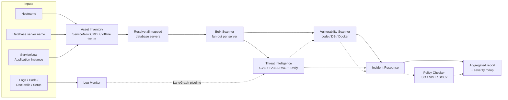

# CyberSecurityAIAgent

An AI-powered cybersecurity system made of multiple agents that monitor logs,
find security issues, and suggest fixes automatically. Built for scalable use in
financial-services environments, with a measurable evaluation harness and a
loop-engineering feedback loop.

## What it does

Five specialised agents are orchestrated with **LangGraph**:

| Agent | Responsibility |
|-------|----------------|
| **Log Monitor Agent** | Reads system/network logs to detect brute-force, SQLi, XSS, path traversal, secret exposure and privilege anomalies. |
| **Threat Intelligence Agent** | Looks up known threats (CVE) using an authorized offline NVD-style corpus + RAG (FAISS), enriched with web search (Tavily). |
| **Vulnerability Scanner Agent** | Scans code, database configs (MSSQL/MySQL/Oracle/PostgreSQL) and Docker images for weaknesses. |
| **Incident Response Agent** | Builds step-by-step action plans (playbooks) from the findings. |
| **Policy Checker Agent** | Checks the setup against ISO 27001, NIST CSF and SOC 2 and scores compliance. |

## Workflow



The same workflow is rendered live in the app's **Workflow** tab.

## Bulk scanning (multiple inputs)

The **Bulk scan** tab (and `main.bulk_scanner.BulkScanner`) accepts any
combination of:

- **Hostnames** — resolves database servers running on / mapped to the host.
- **Database server names** — scans the named servers directly.
- **ServiceNow Application Instance(s)** — queries the CMDB for *all* database
  servers mapped to the application and scans them in bulk.

Resolution is handled by `tools.asset_inventory`. When
`SNOW_INSTANCE_URL` / `SNOW_USERNAME` / `SNOW_PASSWORD` are configured it queries
ServiceNow (`cmdb_ci_appl` + `cmdb_rel_ci`); otherwise it uses the bundled
offline CMDB fixture (`data/cmdb/cmdb.json`). Each resolved server is scanned by
the Vulnerability Scanner + Threat Intelligence agents and gets an
Incident Response plan, with a fleet-wide severity rollup.

```python
from main.bulk_scanner import get_bulk_scanner

report = get_bulk_scanner().run(
    app_instances=["Core Banking"],
    hostnames=["app-web-01.corp"],
    db_servers=["pg-analytics-1"],
)
print(report["summary"])  # total_targets, total_findings, worst_severity, ...
```

## Tech stack

- **Orchestration:** LangChain / LangGraph
- **Vector DB / RAG:** FAISS (with a numpy fallback)
- **LLM:** OpenAI (optional) with a deterministic offline fallback
- **Web search:** Tavily (optional) with an offline corpus fallback
- **UI:** Streamlit
- **Language:** Python 3.10+
- **Deployment:** Streamlit Community Cloud (free tier)

> The system runs **fully offline** with no API keys (deterministic mode), and
> transparently upgrades to live LLM reasoning + web search when keys are set.

## Project structure

```
config/   # typed settings + logging
tools/    # deterministic tools (logs, CVE, scanners, policy, RAG, web search)
main/     # LLM factory, the 5 agents, and the LangGraph orchestrator
evals/    # assertion-based eval harness + loop-engineering demo
app/      # Streamlit UI
data/     # sample logs, CVE corpus, RAG knowledge base
tests/    # unit + integration tests
```

## Quick start

```bash
python -m venv .venv && source .venv/bin/activate
pip install -r requirements.txt
cp .env.example .env            # optional: add OPENAI_API_KEY / TAVILY_API_KEY

# Run the UI
streamlit run app/streamlit_app.py

# Run the eval suite (+ loop-engineering demo)
python -m evals.run_evals --loop

# Run tests
pytest
```

## Configuration

All settings are environment-driven (see `.env.example`). Key flags:

- `OPENAI_API_KEY` — enables live LLM reasoning + OpenAI embeddings.
- `TAVILY_API_KEY` — enables live web search.
- `CSAI_OFFLINE=true` — force deterministic offline mode (useful for evals).

## Evaluation & loop engineering

`python -m evals.run_evals` runs an assertion-based suite (inspired by
lightweight eval frameworks such as `kingsidharth/evals_1`) over a curated
dataset and reports a pass rate. `--loop` runs the loop-engineering demo, which
sweeps the brute-force detection threshold and shows how detection quality
improves as the configuration is tuned.

## Deploying to Streamlit Cloud (free tier)

1. Push this repo to GitHub.
2. On [share.streamlit.io](https://share.streamlit.io), create an app pointing
   at `app/streamlit_app.py`.
3. (Optional) Add `OPENAI_API_KEY` / `TAVILY_API_KEY` under **App → Settings →
   Secrets**. Without them the app runs in offline mode.
